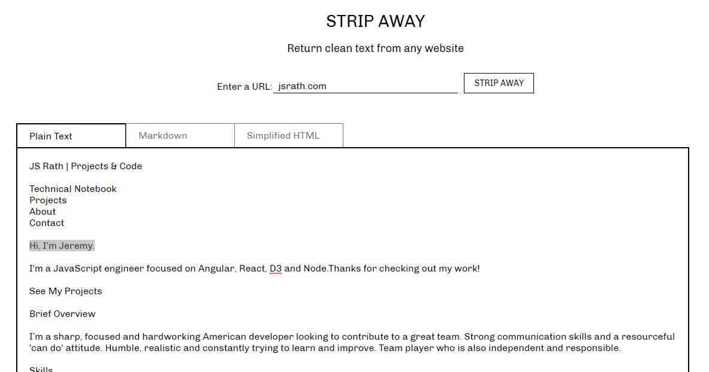

<p align="center">
  
</p>
<p align="center">
  <a href="#">
    
  </a>
  <a href="#">
    
  </a>
</p>
<hr>
<h1 align="center">Strip Away</h1>
<h4 align="center">Return clean unformatted text, markdown and HTML from any website.</h4>
<h3 align="center"><a href="https://strip-away.onrender.com">LIVE SITE</a></h3>

Strip Away generates clean, unformatted text from any website. You can use it to strip away formatting, styles, images and links, leaving you with only the essential text.

Cleaned text is easy to edit right in the browser, or easy to copy/paste to another program.

## Installation

```sh
git clone https://github.com/jsrath/strip-away.git
npm install
npm start
```

## License

> The MIT License (MIT)<br/> Copyright © 2020 JS Rath <br/> Permission is hereby granted, free of charge, to any person obtaining a copy of this software and associated documentation files (the “Software”), to deal in the Software without restriction, including without limitation the rights to use, copy, modify, merge, publish, distribute, sublicense, and/or sell copies of the Software, and to permit persons to whom the Software is furnished to do so, subject to the following conditions: <br/>The above copyright notice and this permission notice shall be included in all copies or substantial portions of the Software. <br/> The software is provided “as is”, without warranty of any kind, express or implied, including but not limited to the warranties of merchantability, fitness for a particular purpose and noninfringement. In no event shall the authors or copyright holders be liable for any claim, damages or other liability, whether in an action of contract, tort or otherwise, arising from, out of or in connection with the software or the use or other dealings in the software.

---

Created and maintained by [JS Rath](http://www.jsrath.com).
